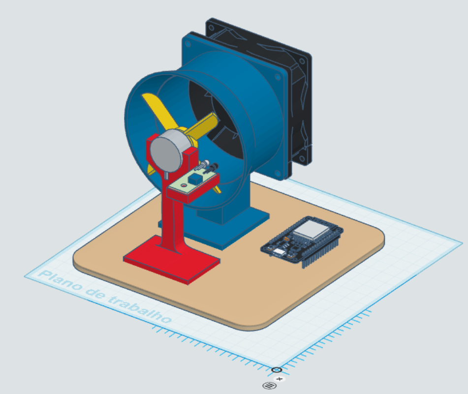
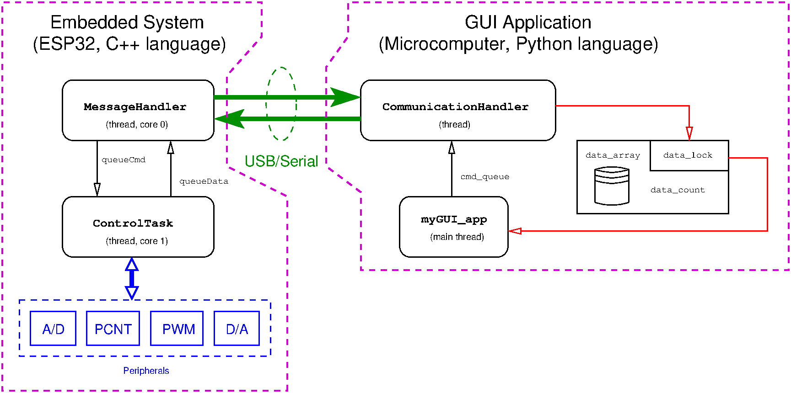

# Plantas Didáticas para Ensino de Teoria de Controle: Descrição de Software

---

## Abstract

This document describes the software system used with low-cost didactic plants being developed in 
the Department of Electronic Engineering at the Federal University of Minas Gerais.
These low-cost 3D print based plants make use of Arduino or ESP32 microprocessor systems.

---

## Introduction

In recent years, the cost of didactic systems for Control education has become a barrier to acquiring new commercial plants from traditional manufacturers.

Simultaneously, the development cost of solutions using microprocessed systems, based on microcontrollers or other Systems-On-Chips (SoCs) like Arduino, ESP32, and Raspberry Pi, has decreased. This is also due to the lower cost of sensors and the use of parts manufactured via additive manufacturing of plastic materials in 3D printers.

*Caption: Example of a developed didactic plant that uses the software system described in this document.*

In this new context, it has become feasible to develop and produce many low-volume, low-weight, and low-cost didactic kits. These kits can accompany the academic journey of students in Control and Automation Engineering, Electrical Engineering, Systems Engineering, and other courses at the UFMG School of Engineering.

In addition to hardware development, creating a software platform that is **user-friendly**, **free**, and **flexible** is essential to accompany the didactic kits, making them easy for students to use.

---

## Overview

The software system for control and data acquisition, used for the low-cost didactic plants developed within the scope of Control and Automation Engineering, Electrical Engineering, and Systems Engineering courses at UFMG, consists of two subsystems:

1.  **Embedded code** on a platform based on an **ESP32 microcontroller**, or System-on-Chip (SoC). This platform features a dual-core processor, wireless networking capabilities, low-energy communication, and various other peripherals (A/D and D/A converters, independent timers, etc.). It executes code with some real-time guarantee (as explained later), utilizing the functions of the **FreeRTOS** real-time library. Programming can be done in the **Arduino IDE** environment or in **Visual Studio Code** with the **PlatformIO** module.

2.  **Code in Python** (version 3.13.1) using the following libraries:
    * **PySide6** (similar to the PyQt library): Provides functions for using the Qt graphical library to produce user interfaces. This library includes a helpful application for designing the graphical user interface (GUI) layout: `pyside6-designer`.
    * **pyqtgraph**: Implements real-time graphics (among others) to display time series data collected during experiments, integrated with the PySide6 library.
    * **pySerial**: Provides functions for reading and writing to the USB/Serial port.
    * **numpy**: For storing and manipulating data in real number matrix format, similar to what is done in the MATLAB environment (commercial software, popular among students and professionals in Electrical Engineering and Control and Automation Engineering from MathWorks). This includes a simple way to save data in CSV (Comma Separated Variables) format.
    * **threading**: For creating two different threads (one for the GUI, and another for receiving and sending messages via USB/Serial to the embedded system).
    * **struct**: For reformatting received messages into sets of floating-point numbers.
    * **queue**: For creating message queues between the communication and GUI threads.
    * **time**: For using the `time.sleep()` function to set the polling interval of the USB/Serial port by the communication thread.

A general overview of the software system can be seen in the diagram shown in Figure 2. This diagram presents the two subsystems mentioned above.

*Caption: General overview of the software structure formed by two subsystems: embedded software on the ESP32 platform; and a GUI executed on a microcomputer.*

---

## Embedded Subsystem

As shown in Figure 2, the embedded code on the ESP32 platform has two threads, each executed on a different core of the main processor:

1.  **Core 0:** `MessageHandler` reads command messages sent by the GUI application on the microcomputer via USB/serial port, and writes data messages via USB/serial port that were collected from the experiment using the didactic platform's hardware. Its execution period is $20\,\text{ms}$ ($50\,\text{Hz}$).

2.  **Core 1:** `ControlTask` performs the following functions, in this order, every $2\,\text{ms}$ ($500\,\text{Hz}$):
    * Computes reference signals as a function of time.
    * Reads sensor signals and processes them appropriately. Sensor signals are obtained using ADC (Analog-to-Digital Converter) and/or PCNT (Pulse Counter) peripherals.
    * Calculates the control action.
    * Commands the actuation systems appropriately. Actuation peripherals used are PWM (Pulse Width Modulator) and/or DAC (Digital-to-Analog Converter).

Communication from `MessageHandler` to `ControlTask` to send commands received via the USB/Serial port for execution (such as `START`, `STOP`, and `SET_REF_CMD`) occurs through non-blocking writes to the `queueCmd` queue. Obtaining the data to be sent via the USB/Serial port, collected by the execution of the `ControlTask` thread, is done by non-blocking reads performed by the `MessageHandler` thread from the `queueData` queue. Similarly, `ControlTask` writes non-blocking to `queueData` collected data, and reads non-blocking from `queueCmd` the commands placed by the `MessageHandler` thread.

During the initialization of the embedded subsystem, several functions are executed in the following order:

* Configuration and initialization of the USB/Serial port communication mechanism.
* Creation of the `queueCmd` and `queueData` queues.
* Creation and start of the `MessageHandler` and `ControlTask` threads on different cores.
* The `ControlTask` task creates a local object within the thread, an instance of the `ControlSystem` class, and executes the following steps:
    * Initializes internal variables (internal states) of the control system.
    * Initializes the reference signal generation mechanism.
    * Configures the measurement processes for the specific didactic plant used.
    * Configures the actuation processes for the specific didactic plant used.

---

## Graphical User Interface (GUI) Subsystem

This subsystem has two threads:

1.  `LabControl_GUI`: Responsible for executing the infinite loop of graphical interface event handling, using the PySide6 library. This includes updating data shown in time-series graphs by reading data stored in the `data_array` matrix.

2.  `CommunicationHandler`: Reads data messages from the USB/Serial port and stores the collected data in the `numpy` matrix `data_array`. It also writes command messages to the embedded system, also via the USB/Serial port.

Access for reading and writing to the global variables `data_array` and `data_count` (the latter stores the number of collected samples) is mediated by a simple non-reentrant Mutex semaphore created using the `threading.Lock()` function.

Using this type of data structure allows for the simultaneous writing of multiple collected samples as rows in the `data_array` matrix. This need arises whenever multiple data messages are processed by the `CommunicationHandler` thread when they are found together in the memory buffer associated with USB/Serial port management. Another mechanism previously used, based on a queue, allowed writing one data point at a time and has been replaced by this method based on a global variable `data_array` with access controlled via Mutex.

However, the queue mechanism is still used for sending messages from the `LabControl_GUI` thread to the `CommunicationHandler` thread.

---

## How to Modify the System for Each Didactic Plant
